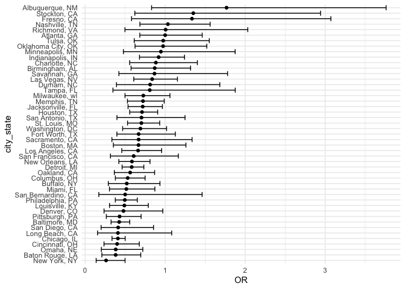
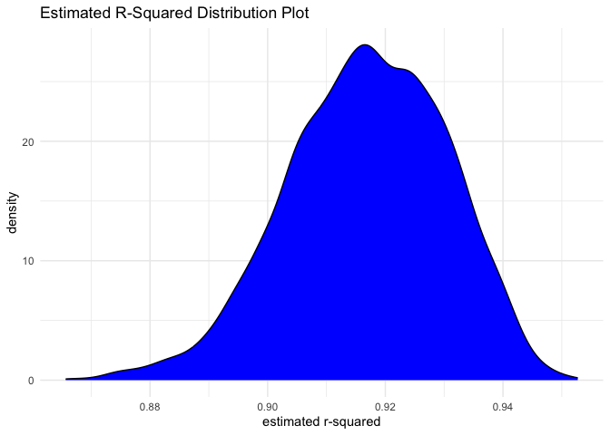
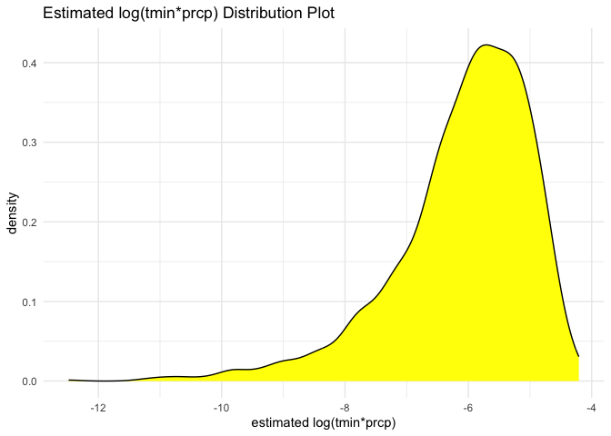
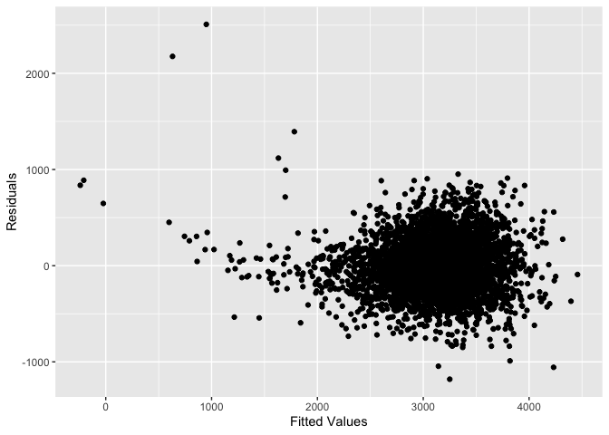
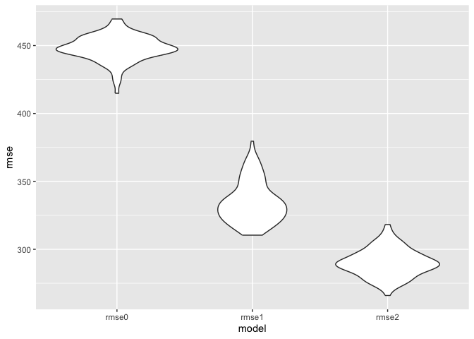

p8105_hw6_yg2907
================
2023-12-02

``` r
library(tidyverse)
```

    ## ── Attaching core tidyverse packages ──────────────────────── tidyverse 2.0.0 ──
    ## ✔ dplyr     1.1.3     ✔ readr     2.1.4
    ## ✔ forcats   1.0.0     ✔ stringr   1.5.0
    ## ✔ ggplot2   3.4.3     ✔ tibble    3.2.1
    ## ✔ lubridate 1.9.2     ✔ tidyr     1.3.0
    ## ✔ purrr     1.0.2     
    ## ── Conflicts ────────────────────────────────────────── tidyverse_conflicts() ──
    ## ✖ dplyr::filter() masks stats::filter()
    ## ✖ dplyr::lag()    masks stats::lag()
    ## ℹ Use the conflicted package (<http://conflicted.r-lib.org/>) to force all conflicts to become errors

``` r
library(boot)
library(broom)
library(purrr)
library(ggplot2)
library(mgcv)
```

    ## Loading required package: nlme
    ## 
    ## Attaching package: 'nlme'
    ## 
    ## The following object is masked from 'package:dplyr':
    ## 
    ##     collapse
    ## 
    ## This is mgcv 1.9-0. For overview type 'help("mgcv-package")'.

``` r
library(modelr)
```

    ## 
    ## Attaching package: 'modelr'
    ## 
    ## The following object is masked from 'package:broom':
    ## 
    ##     bootstrap

# Problem 1

``` r
homicides <- read.csv("./data/homicide-data.csv", na = c("", "NA", "Unknown"))

homicides <- homicides |>
  mutate(city_state = str_c(city, state, sep = ", "),
         resolution = case_when(
         disposition %in% c("Closed without arrest", "Open/No arrest") ~ 0,
         disposition == "Closed by arrest" ~ 1),
         victim_age = as.numeric(victim_age),
         )|>
  filter(!city_state %in% c("Dallas, TX", "Phoenix, AZ", "Kansas City, MO", "Tulsa, AL"))|> 
           filter(victim_race %in% c("White", "Black"))|>
  select(city_state, resolution, victim_age, victim_sex, victim_race)
```

``` r
baltimore_glm <- homicides |>
  filter(city_state == "Baltimore, MD") |>
  glm(formula = resolution ~ victim_age + victim_sex + victim_race, data = _, family = binomial())

baltimore_glm |> 
  broom::tidy() |> 
  mutate(
    OR = exp(estimate), 
    OR_CI_upper = exp(estimate + 1.96 * std.error),
    OR_CI_lower = exp(estimate - 1.96 * std.error)) |> 
  filter(term == "victim_sexMale") |> 
  select(OR, OR_CI_lower, OR_CI_upper) |>
  knitr::kable(digits = 3)
```

|    OR | OR_CI_lower | OR_CI_upper |
|------:|------------:|------------:|
| 0.426 |       0.325 |       0.558 |

``` r
model_results <- homicides |>
  group_by(city_state) |>
  nest() |>
  mutate(
    models = map(data, function(df) {
      glm(resolution ~ victim_age + victim_sex + victim_race, family = binomial(), data = df)
    }),
    tidy_models = map(models, broom::tidy)
  ) |>
  select(-models, -data) |>
  unnest(cols = tidy_models) |>
  mutate(
    OR = exp(estimate),
    OR_CI_upper = exp(estimate + 1.96 * std.error),
    OR_CI_lower = exp(estimate - 1.96 * std.error)
  ) |>
  filter(term == "victim_sexMale") |>
  select(city_state, OR, OR_CI_lower, OR_CI_upper) |>
  ungroup()

model_results |>
  knitr::kable(digits = 3)
```

| city_state         |    OR | OR_CI_lower | OR_CI_upper |
|:-------------------|------:|------------:|------------:|
| Albuquerque, NM    | 1.767 |       0.831 |       3.761 |
| Atlanta, GA        | 1.000 |       0.684 |       1.463 |
| Baltimore, MD      | 0.426 |       0.325 |       0.558 |
| Baton Rouge, LA    | 0.381 |       0.209 |       0.695 |
| Birmingham, AL     | 0.870 |       0.574 |       1.318 |
| Boston, MA         | 0.667 |       0.354 |       1.260 |
| Buffalo, NY        | 0.521 |       0.290 |       0.935 |
| Charlotte, NC      | 0.884 |       0.557 |       1.403 |
| Chicago, IL        | 0.410 |       0.336 |       0.501 |
| Cincinnati, OH     | 0.400 |       0.236 |       0.677 |
| Columbus, OH       | 0.532 |       0.378 |       0.750 |
| Denver, CO         | 0.479 |       0.236 |       0.971 |
| Detroit, MI        | 0.582 |       0.462 |       0.734 |
| Durham, NC         | 0.812 |       0.392 |       1.683 |
| Fort Worth, TX     | 0.669 |       0.397 |       1.127 |
| Fresno, CA         | 1.335 |       0.580 |       3.071 |
| Houston, TX        | 0.711 |       0.558 |       0.907 |
| Indianapolis, IN   | 0.919 |       0.679 |       1.242 |
| Jacksonville, FL   | 0.720 |       0.537 |       0.966 |
| Las Vegas, NV      | 0.837 |       0.608 |       1.154 |
| Long Beach, CA     | 0.410 |       0.156 |       1.082 |
| Los Angeles, CA    | 0.662 |       0.458 |       0.956 |
| Louisville, KY     | 0.491 |       0.305 |       0.790 |
| Memphis, TN        | 0.723 |       0.529 |       0.988 |
| Miami, FL          | 0.515 |       0.304 |       0.872 |
| Milwaukee, wI      | 0.727 |       0.499 |       1.060 |
| Minneapolis, MN    | 0.947 |       0.478 |       1.875 |
| Nashville, TN      | 1.034 |       0.685 |       1.562 |
| New Orleans, LA    | 0.585 |       0.422 |       0.811 |
| New York, NY       | 0.262 |       0.138 |       0.499 |
| Oakland, CA        | 0.563 |       0.365 |       0.868 |
| Oklahoma City, OK  | 0.974 |       0.624 |       1.520 |
| Omaha, NE          | 0.382 |       0.203 |       0.721 |
| Philadelphia, PA   | 0.496 |       0.378 |       0.652 |
| Pittsburgh, PA     | 0.431 |       0.265 |       0.700 |
| Richmond, VA       | 1.006 |       0.498 |       2.033 |
| San Antonio, TX    | 0.705 |       0.398 |       1.249 |
| Sacramento, CA     | 0.669 |       0.335 |       1.337 |
| Savannah, GA       | 0.867 |       0.422 |       1.780 |
| San Bernardino, CA | 0.500 |       0.171 |       1.462 |
| San Diego, CA      | 0.413 |       0.200 |       0.855 |
| San Francisco, CA  | 0.608 |       0.317 |       1.165 |
| St. Louis, MO      | 0.703 |       0.530 |       0.932 |
| Stockton, CA       | 1.352 |       0.621 |       2.942 |
| Tampa, FL          | 0.808 |       0.348 |       1.876 |
| Tulsa, OK          | 0.976 |       0.614 |       1.552 |
| Washington, DC     | 0.691 |       0.469 |       1.018 |

``` r
model_results |>
  mutate(city_state = fct_reorder(city_state, OR)) |>
  ggplot(aes(x = city_state, y = OR)) +
  geom_point() +
  geom_errorbar(aes(ymin = OR_CI_lower, ymax = OR_CI_upper)) +
  coord_flip() +  
  labs(x = "city_state", y = "OR") +
  theme_minimal()
```

<!-- -->

The plot above shows the estimated ORs and CI for each city. The plot
showed OR was less than 1 in most cities, meaning crimes with male
victims are less likely to be resolved compared to those with female
victims after accounting for victim age/race. New York showed the most
disparity. About half of the cities show a narrow CI that doesn’t
include 1, showing statistically significant differences in resolution
rates between the sexes after adjustments.

# Problem 2

``` r
set.seed(1)

weather_df = 
  rnoaa::meteo_pull_monitors(
    c("USW00094728"),
    var = c("PRCP", "TMIN", "TMAX"), 
    date_min = "2022-01-01",
    date_max = "2022-12-31") |>
  mutate(
    name = recode(id, USW00094728 = "CentralPark_NY"),
    tmin = tmin / 10,
    tmax = tmax / 10) |>
  select(name, id, everything())
```

    ## using cached file: /Users/gaoyuandi18/Library/Caches/org.R-project.R/R/rnoaa/noaa_ghcnd/USW00094728.dly

    ## date created (size, mb): 2023-12-02 21:58:23.020416 (8.544)

    ## file min/max dates: 1869-01-01 / 2023-11-30

## Fit the Regression Line

``` r
fit = lm(tmax ~ tmin + prcp, data = weather_df)
```

## Bootstrapping

Create a bootstrapping function.

``` r
boot_sample = function(df){
  sample_frac(df, replace = TRUE)
}
```

Create 5000 bootstrapping samples by using a list column.

``` r
boot_straps = 
  tibble(strap_number = 1:5000)|>
  mutate(
    strap_sample = map(strap_number, \(i) boot_sample(df = weather_df))
  )

boot_straps
```

    ## # A tibble: 5,000 × 2
    ##    strap_number strap_sample      
    ##           <int> <list>            
    ##  1            1 <tibble [365 × 6]>
    ##  2            2 <tibble [365 × 6]>
    ##  3            3 <tibble [365 × 6]>
    ##  4            4 <tibble [365 × 6]>
    ##  5            5 <tibble [365 × 6]>
    ##  6            6 <tibble [365 × 6]>
    ##  7            7 <tibble [365 × 6]>
    ##  8            8 <tibble [365 × 6]>
    ##  9            9 <tibble [365 × 6]>
    ## 10           10 <tibble [365 × 6]>
    ## # ℹ 4,990 more rows

### 95% Confidence Interval for $\hat{r^{2}}$

For each bootstrap sample, produce estimates of the two desired
quantities.

``` r
bootstrap_results = 
  boot_straps |> 
  mutate(
    models = map(strap_sample, \(df) lm(tmax ~ tmin + prcp, data = df) ),
    results = map(models, broom::glance)) |> 
  select(-strap_sample, -models) |> 
  unnest(results) 

# identify the 2.5% and 97.5% quantiles to provide a 95% confidence interval for estimated r^2
r_squared = bootstrap_results |> 
  summarize(
    lower_r_squared = quantile(r.squared, 0.025),
    upper_r_squared = quantile(r.squared, 0.975)) |> 
  knitr::kable(digits = 3)
```

Therefore, the 2.5% and 97.5% quantiles to provide a 95% confidence
interval for estimated $\hat{r^{2}}$ is approximately 0.889 and 0.941.
We’re 95% confident that the true estimated r^2 lies between 0.889 and
0.941.

### Plot the Distribution of $\hat{r^{2}}$

``` r
bootstrap_results|>
  ggplot(aes(x = r.squared)) +
  geom_density(fill = "blue") +
  theme_minimal() +
  labs(
    title = "Estimated R-Squared Distribution Plot",
    x = "estimated r-squared",
    y = "density"
  )
```

<!-- -->

Based on the density plot of estimated r-squared, the distribution is
slightly left-skewed and most of the data points gathered around 0.91 to
0.92. Since the large percent of the variability in the outcome can be
explained by the regression model. As a result, this indicates that our
model is in goodness of fit if solely based on the r-squared
distribution.

### 95% CI for $\log(\hat{\beta_0}*\hat{\beta_1})$

``` r
logresult = 
  boot_straps |> 
  mutate(
    models = map(strap_sample, \(df) lm(tmax ~ tmin + prcp, data = df) ),
    log_results = map(models, broom::tidy)) |> 
  select(-strap_sample, -models) |> 
  unnest(log_results)|>
  filter(term == "tmin"|term == "prcp")|>
  select(strap_number:estimate)|>
  pivot_wider(names_from = term,
              values_from = estimate)|>
  mutate(log_estimates = log(tmin*prcp))|>
  na.omit()|>
   summarize(
    lower_log_estimates = quantile(log_estimates, 0.025),
    upper_log_estimates = quantile(log_estimates, 0.975)) |> 
  knitr::kable(digits = 3)
```

    ## Warning: There was 1 warning in `mutate()`.
    ## ℹ In argument: `log_estimates = log(tmin * prcp)`.
    ## Caused by warning in `log()`:
    ## ! NaNs produced

Therefore, the 95% CI of $\log(\hat{\beta_0}*\hat{\beta_1})$ is
approximately (-8.982, -4.602). We’re 95% confident that the true
estimated $\log(\hat{\beta_0}*\hat{\beta_1})$ coefficient lies between
-8.982 and -4.602.

### Plot the Distribution of $\log(\hat{\beta_0}*\hat{\beta_1})$

``` r
  boot_straps |> 
  mutate(
    models = map(strap_sample, \(df) lm(tmax ~ tmin + prcp, data = df) ),
    log_results = map(models, broom::tidy)) |> 
  select(-strap_sample, -models) |> 
  unnest(log_results)|>
  filter(term == "tmin"|term == "prcp")|>
  select(strap_number:estimate)|>
  pivot_wider(names_from = term,
              values_from = estimate)|>
  mutate(log_estimates = log(tmin*prcp))|>
  na.omit()|>
  ggplot(aes(x = log_estimates)) +
  geom_density(fill = "yellow") +
  theme_minimal() +
  labs(
    title = "Estimated log(tmin*prcp) Distribution Plot",
    x = "estimated log(tmin*prcp)",
    y = "density"
  )
```

    ## Warning: There was 1 warning in `mutate()`.
    ## ℹ In argument: `log_estimates = log(tmin * prcp)`.
    ## Caused by warning in `log()`:
    ## ! NaNs produced

<!-- -->

Based on the density plot of estimated
$\log(\hat{\beta_0}*\hat{\beta_1})$, the distribution is left-skewed and
most of the data points gathered around -6, which corresponds to our
previous 95% CI. After log transformation, the distribution is not
normal.

# Problem 3

``` r
birthweight <- read.csv("./data/birthweight.csv")
```

``` r
birthweight <- birthweight |>
  mutate(
    babysex = as_factor(babysex),
    frace = as_factor(frace),
    mrace = as_factor(mrace)
  )

# check missing value
sum(is.na(birthweight))
```

    ## [1] 0

``` r
test_regression_model <- lm(bwt ~ ., data = birthweight)
summary(test_regression_model)
```

    ## 
    ## Call:
    ## lm(formula = bwt ~ ., data = birthweight)
    ## 
    ## Residuals:
    ##      Min       1Q   Median       3Q      Max 
    ## -1097.68  -184.86    -3.33   173.09  2344.15 
    ## 
    ## Coefficients: (3 not defined because of singularities)
    ##               Estimate Std. Error t value Pr(>|t|)    
    ## (Intercept) -6265.3914   660.4011  -9.487  < 2e-16 ***
    ## babysex2       28.7073     8.4652   3.391 0.000702 ***
    ## bhead         130.7781     3.4523  37.881  < 2e-16 ***
    ## blength        74.9536     2.0217  37.075  < 2e-16 ***
    ## delwt           4.1007     0.3948  10.386  < 2e-16 ***
    ## fincome         0.2898     0.1795   1.614 0.106551    
    ## frace2         14.3313    46.1501   0.311 0.756168    
    ## frace3         21.2361    69.2960   0.306 0.759273    
    ## frace4        -46.9962    44.6782  -1.052 0.292912    
    ## frace8          4.2969    74.0741   0.058 0.953745    
    ## gaweeks        11.5494     1.4654   7.882 4.06e-15 ***
    ## malform         9.7650    70.6259   0.138 0.890039    
    ## menarche       -3.5508     2.8951  -1.226 0.220083    
    ## mheight         9.7874    10.3116   0.949 0.342588    
    ## momage          0.7593     1.2221   0.621 0.534418    
    ## mrace2       -151.4354    46.0453  -3.289 0.001014 ** 
    ## mrace3        -91.3866    71.9190  -1.271 0.203908    
    ## mrace4        -56.4787    45.1369  -1.251 0.210901    
    ## parity         95.5411    40.4793   2.360 0.018307 *  
    ## pnumlbw             NA         NA      NA       NA    
    ## pnumsga             NA         NA      NA       NA    
    ## ppbmi           4.3538    14.8913   0.292 0.770017    
    ## ppwt           -3.4716     2.6121  -1.329 0.183913    
    ## smoken         -4.8544     0.5871  -8.269  < 2e-16 ***
    ## wtgain              NA         NA      NA       NA    
    ## ---
    ## Signif. codes:  0 '***' 0.001 '**' 0.01 '*' 0.05 '.' 0.1 ' ' 1
    ## 
    ## Residual standard error: 272.5 on 4320 degrees of freedom
    ## Multiple R-squared:  0.7183, Adjusted R-squared:  0.717 
    ## F-statistic: 524.6 on 21 and 4320 DF,  p-value: < 2.2e-16

``` r
# chose those who p-value < 0.05
birthweight_regression_model <- lm(bwt ~ babysex + bhead + blength + delwt + gaweeks + parity + smoken, data = birthweight)

residuals <- birthweight |>
  add_predictions(birthweight_regression_model, var = "pred") |>
  add_residuals(birthweight_regression_model, var = "resid")
```

``` r
ggplot(residuals, aes(x = pred, y = resid)) +
  geom_point() +
  labs(x = "Fitted Values", y = "Residuals")
```

<!-- -->

``` r
# Model comparison using cross-validation
cv_folds <- crossv_mc(birthweight, 100) 

cv_results <- cv_folds |>
  mutate(
    model0 = map(train, \(df) lm(bwt ~ delwt + gaweeks + smoken, data = df)),
    model1 = map(train, \(df) lm(bwt ~ blength + gaweeks, data = df)),
    model2 = map(train, \(df) lm(bwt ~ bhead + blength + babysex + bhead * blength + blength * babysex + bhead * babysex + bhead * blength * babysex, data = df)),
    rmse0 = map2_dbl(model0, test, \(mod, df) rmse(model = mod, data = df)),
    rmse1 = map2_dbl(model1, test, \(mod, df) rmse(model = mod, data = df)),
    rmse2 = map2_dbl(model2, test, \(mod, df) rmse(model = mod, data = df))
  )
```

``` r
cv_results |> 
  select(starts_with("rmse")) |> 
  pivot_longer(
    everything(),
    names_to = "model", 
    values_to = "rmse",
    names_prefix = "rmse_") |> 
  mutate(model = fct_inorder(model)) |> 
  ggplot(aes(x = model, y = rmse)) + geom_violin()
```

<!-- -->

In this Graph, with rmse2 \< rmse1 \< rmse0 showing above. The model
produced above has the highest RMSE values, suggesting that it may be
the least accurate model. In contrast, Model 2 (head circumference,
length, sex, and all interactions) has the lowest RMSE values and the
smallest variability, suggesting that it is the most accurate and
consistent model of the three.
